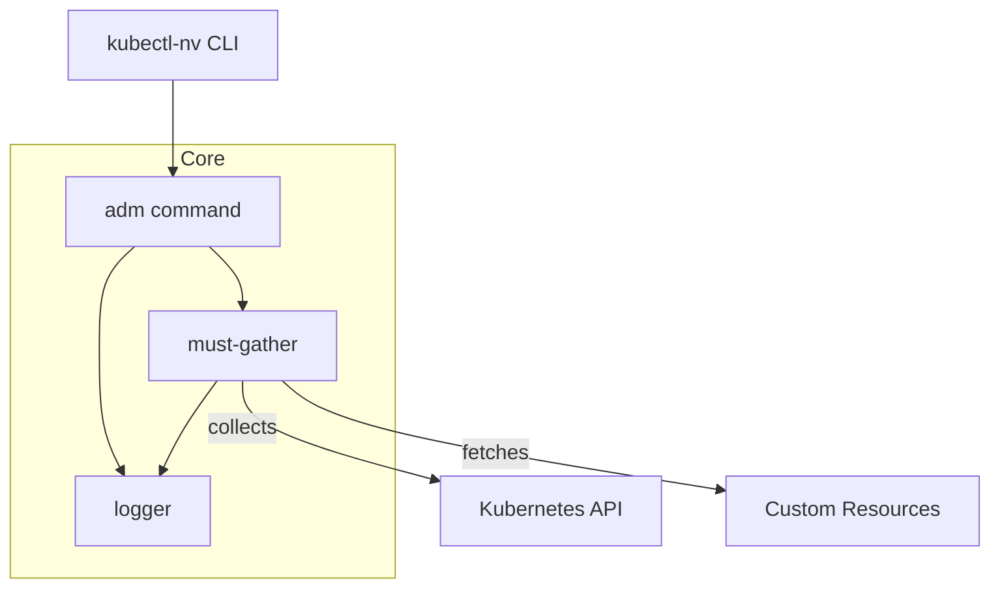

# kubectl-nv Documentation

## Overview

`kubectl-nv` is a kubectl plugin for managing and troubleshooting
NVIDIA GPU resources in Kubernetes clusters. It provides admin
commands for diagnostics, must-gather, and operator support.

## Quick Start

```bash
# Install (from source)
git clone https://github.com/NVIDIA/kubectl-nv.git
cd kubectl-nv
make build
./bin/kubectl-nv --help
```

## Architecture



## Documentation Index

- [Usage](usage.md)
- [Installation](installation.md)
- [Design](design.md)
- [Contributing](contributing.md)
- [Testing](testing.md)
